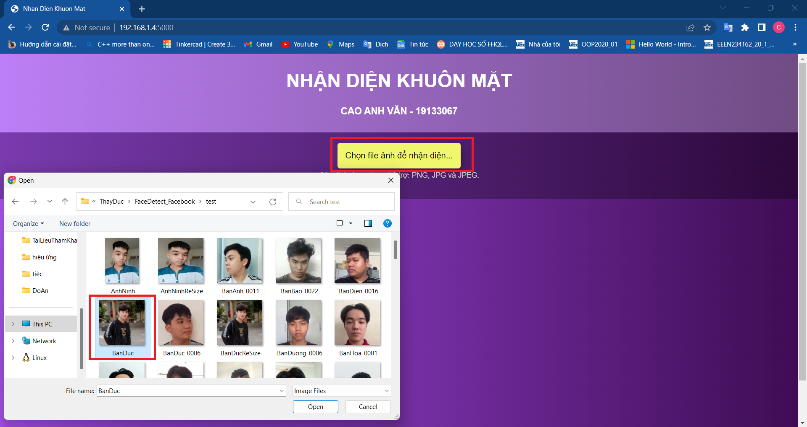

# FaceDetect_Facebook
# Đồ án học phần xử lý ảnh số 
## Project sẽ tạo ra  một trang web đơn giản cho phép người dùng tải lên hình ảnh và sẽ trả về hình ảnh đã kèm text nhận diện 
### Bài làm sử dụng opencv với module nhận diện của Facebook
#### Các bước chạy project :

**Bước 1 :** Tiến hành chạy file GetImageFromVideo.py ở folder Buoc1 để lấy các ảnh từ video

**Bước 2 :** Tiến hành chạy file Training.py ở folder Buoc2 tiến hành training model. Quá trình training sẽ tạo ra file svc.pkl

**Bước 3 :** Sau đó copy file svc.pkl vào folde Buoc3

**Bước 4 :** Chạy file svr_model.py để start web

## Hướng dẫn sử dụng web nhận diện

**Giao diện của trang web**

**Bước 1** : Nhấn vào nút "Chọn file ảnh để nhận diện" sau đó chọn ảnh cần nhận diện

**Bước 2** : Kết quả nhận diện sẽ được hiển thị ngay bên dưới

