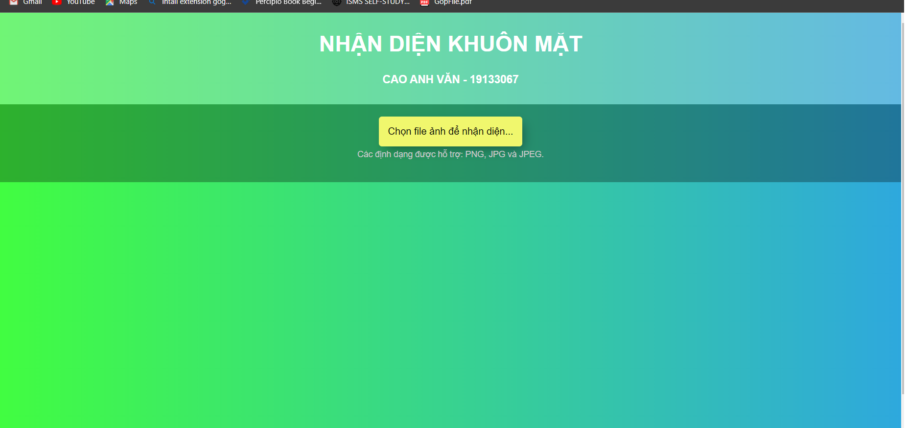

# FaceDetect_Facebook
# Đồ án học phần xử lý ảnh số 
## Project sẽ tạo ra  một trang web đơn giản cho phép người dùng tải lên hình ảnh và sẽ trả về hình ảnh đã kèm text nhận diện 
### Bài làm sử dụng opencv với module nhận diện của Facebook
#### Các bước chạy project :

<h5>Tiến hành chạy file GetImageFromVideo.py ở folder Buoc1 để lấy các ảnh từ video</h5>
<h5>Tiến hành chạy file Training.py ở folder Buoc2 tiến hành training model. Quá trình training sẽ tạo ra file svc.pkl</h5>
<h5>Sau đó copy file svc.pkl vào folde Buoc3</h5>
<h5>Chạy file svr_model.py để start web</h5>

Hướng dẫn sử dụng web nhận diện

<h5>Giao diện của trang web</h5>

<h5>Bước 1 : Nhấn vào nút "Chọn file ảnh để nhận diện" sau đó chọn ảnh cần nhận diện</h5>

<h5>Bước 2 : 
Kết quả nhận diện sẽ được hiển thị ngay bên dưới
</h5>

